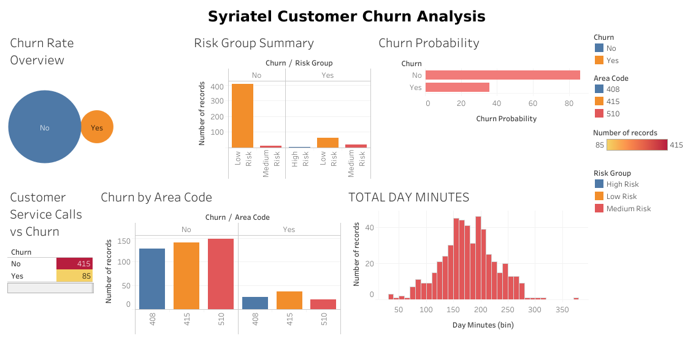

# Syriatel Customer Churn Prediction

Predicting customer churn for Syriatel, a telecom provider, using machine learning and data analytics. The goal is to identify factors driving churn and build a predictive model to retain high-risk customers.

**Author:** [Hellen Diana](https://github.com/HellenDianaNjeri/SyriaTel-Customer-Churn.git)

---

## Business Understanding

Customer churn is a critical issue in the telecom industry. By predicting churn, Syriatel can take proactive steps to retain customers and reduce revenue loss.

> **Objective:** Classify whether a customer will churn (`yes`) or not (`no`) based on service usage and interactions.

---

## Dataset Information

- **Source:** [Kaggle - Telco Customer Churn](https://www.kaggle.com/datasets/becksddf/churn-in-telecoms-dataset)
- **Records:** ~3,333 customers
- **Target Variable:** `churn` (Yes/No)

### Key Features

| Feature                   | Description                                |
|---------------------------|--------------------------------------------|
| `account length`          | Duration of customer account (in days)     |
| `intl plan`, `vmail plan` | Binary service indicators                  |
| `total day/night calls`   | Number of calls made during time segments  |
| `custserv calls`          | Calls made to customer service             |
| `total charge`            | Total amount charged across all services   |

---

## Exploratory Data Analysis (EDA)

### Class Distribution

- Imbalanced: ~86% non-churn vs ~14% churn
- Addressed using **resampling techniques** in the ML pipeline

### Feature Distributions

| Feature            | Distribution | Insights                                              |
|--------------------|--------------|--------------------------------------------------------|
| `account length`   | Normal       | Consistent account tenures                             |
| `vmail messages`   | Right-skewed | Majority don’t use voicemail                          |
| `custserv calls`   | Right-skewed | High calls may signal dissatisfaction → churn factor  |

---

## Statistical Analysis

### Chi-Square Test

Significant dependency found between **churn** and:
- `custserv calls`
- `intl plan`

### ANOVA

Revealed significant variance in `total_charge`, `day_minutes`, etc., across churn categories.

---

## Machine Learning Pipeline

### 1. Data Preparation 
- Encoding categorical variables
- Feature scaling
- Stratified train-test split

### 2. Feature Engineering 
- Created features: `cost_per_minute`, `calls_per_day`, `intl_plan_and_calls`
- Added interaction terms with `custserv calls` and `intl plan`

### 3. Model Building
- Logistic Regression
- Decision Tree
- Random Forest
- Support Vector Machine (SVM)
- XGBoost
- K-Nearest Neighbors (KNN)

### 4. Evaluation Metrics
- Accuracy
- Precision, Recall, F1-score
- ROC AUC
- Confusion Matrix

---

## Tools & Libraries

- Python: `pandas`, `numpy`, `scikit-learn`, `matplotlib`, `seaborn`
- XGBoost
- Jupyter Notebook
- Git & GitHub

---

## Final Model: XGBoost with Threshold Tuning

| Metric    | Score |
|-----------|-------|
| Accuracy  | 93%   |
| Precision | 83%   |
| Recall    | 80%   |
| ROC AUC   | 0.90  |

 Chosen due to its balanced performance and ability to identify churners with high precision and recall.

---

## Key Recommendations

- Proactively target customers with frequent customer service calls and international plans.
- Use churn probability scores for targeted marketing and retention offers.
- Monitor and retrain model periodically to maintain performance.

---

---

## 📊 Interactive Dashboard

Explore the interactive dashboard built with Tableau to visualize churn patterns, customer behavior, and high-risk segments:

[🔗 View Full Dashboard on Tableau Public](https://public.tableau.com/app/profile/hellen.diana.macharia/viz/SyriatelCustomerChurnAnalysis/Dashboard1?publish=yes)




##  How to Run

1. **Clone the repository:**
   ```bash
   git clone https://github.com/HellenDianaNjeri/SyriaTel-Customer-Churn.git
   cd SyriaTel-Customer-Churn

2. Install dependencies:
    ```
    pip install -r requirements.txt

3. Run the notebook:
    ```
    jupyter notebook SyriaTel Customer Churn.ipynb

# License

This project is licensed under the MIT License


